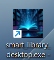
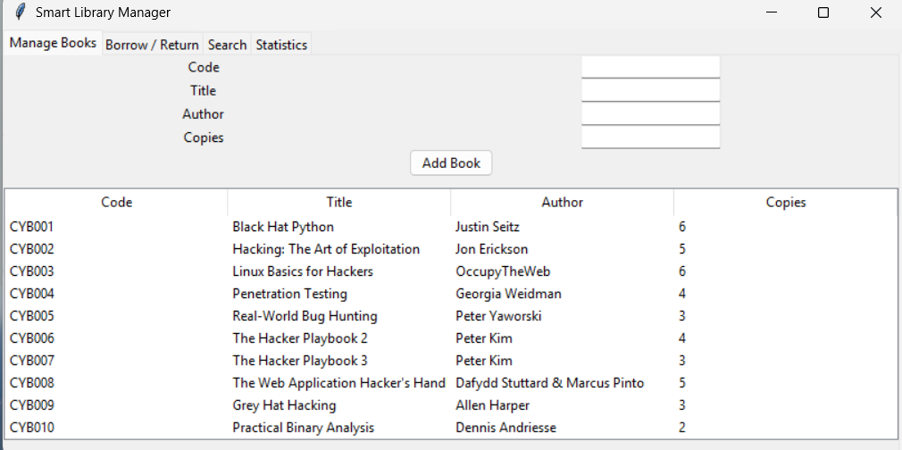
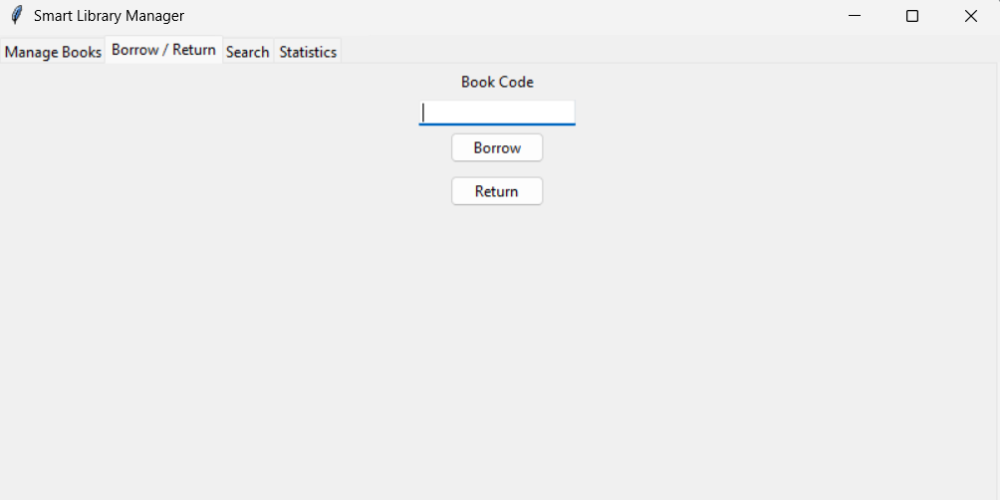
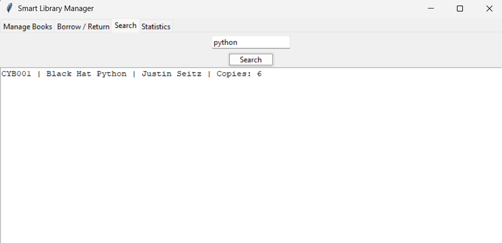
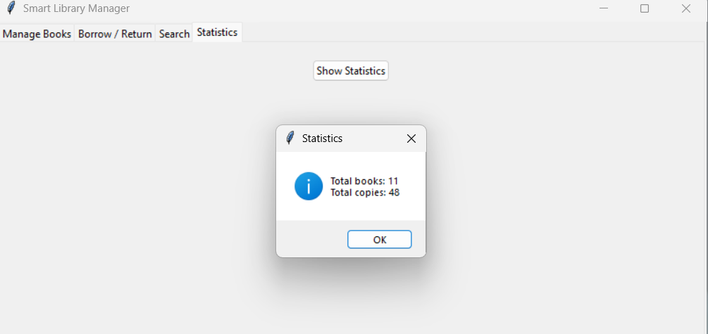

# Smart Library Manager

A simple desktop library management app built with Python, Tkinter, and SQLite.

The app lets you manage a small book collection from a graphical interface. You can add books, borrow and return copies, search by title or author, and view basic library statistics.

## Features

- Add books with a unique code, title, author, and number of copies
- View all books in a table
- Borrow a book by code
- Return a book by code
- Search books by title or author
- Show total book titles and total available copies
- Store data locally in an SQLite database
- Build a Windows `.exe` using PyInstaller

## Project Structure

```text
.
|-- smart_library_desktop.py      # Main Tkinter desktop application
|-- db_setup.py                   # Optional database setup script
|-- test.py                       # Earlier/alternate version of the app
|-- library.db                    # SQLite database file
|-- library.ico                   # App icon
|-- smart_library_desktop.spec    # PyInstaller build configuration
|-- build/                        # PyInstaller build files
`-- dist/                         # Built executable output
```

## Requirements

- Python 3.x
- Tkinter, included with most Python installations
- SQLite, included with Python through the `sqlite3` module
- PyInstaller, only needed if you want to build the executable

## How to Run

Clone the repository and open the project folder:

```bash
git clone https://github.com/abderrahmane-imlouli/smart-library-manager.git
cd smart-library-manager
```

Run the app:

```bash
python smart_library_desktop.py
```

The application will create the `books` table automatically if it does not already exist.

## Optional: Create the Database Manually

You can also run:

```bash
python db_setup.py
```

This creates a local `library.db` file. The main app can also create its required table by itself when it starts.

## Build the Windows Executable

Install PyInstaller:

```bash
pip install pyinstaller
```

Build the app using the included spec file:

```bash
pyinstaller smart_library_desktop.spec
```

After the build finishes, the executable will be available in:

```text
dist/smart_library_desktop.exe
```

## Usage

1. Open the app.
2. Go to the **Manage Books** tab to add books.
3. Use the **Borrow / Return** tab to update copies using a book code.
4. Use the **Search** tab to find books by title or author.
5. Use the **Statistics** tab to view totals.

## Notes

- Book codes must be unique.
- The database is stored locally in `library.db`.
- If you share this project on GitHub, you may want to ignore generated files such as `build/`, `dist/`, and `*.spec` depending on whether you want to include the executable build files.

## screenshots from the app
* app icon :
  
  
  
* manage books :
  
  
  
* borrow and return books :

  
  
* search for a book :
  
  
  
* statistics :
  
  
  
## Author 
 imlouli abderrahmane
 
## License
This project is licensed under the MIT License — see the [LICENSE](LICENSE) file for details.
